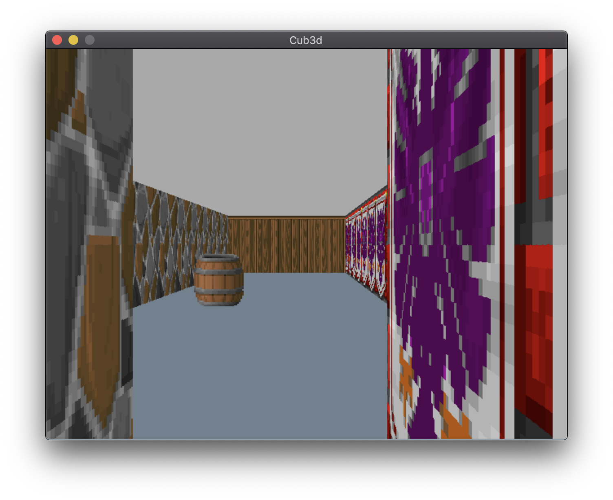

# cub3d

### :mag_right:Evaluated
+ score : 100
### :mag_right: Objective
- to make a simple game by using raycasting like https://en.wikipedia.org/wiki/Wolfenstein_3D

### :mag_right: Commands
- if not : ```make``` -> ```./cub3d map_basic.cub```
- Left and Right **arrow keys** :  look left and right in the maze
- **W**(go forward), **A**(go left), **S**(go backward), **D**(go right)
- press **ESC** to exit